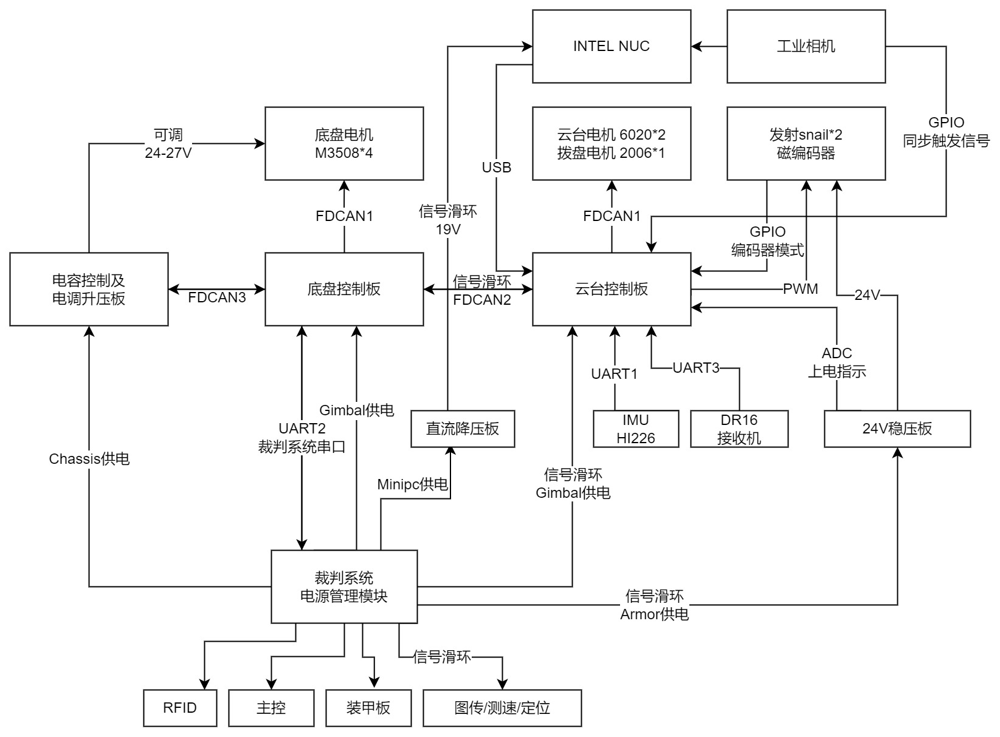

# Infantry_Oreo 2022

本项目为北京理工大学Dream Chaser战队2022年麦轮步兵电控代码，以下为硬软件定义、电源树、通信协议与使用说明。

### 各电机ID定义

底盘电机电调配置：左前轮电调ID为1，顺时针旋转编号，反馈报文0x201-0x204。

云台PITCH轴电机反馈报文0x206（拨码[2:0]为010）；云台YAW电机反馈报文0x205（拨码[2:0]为001）。此处需在装车时提前对GM6020电机拨码进行配置。

云台拨盘2006电机反馈报文0x204。

### 各功能接口定义

##### 云台板

遥控器：UART3  (配置：波特率100000Bits/s，数据位9BITS，偶校验EVEN，停止位1)

IMU：    UART1  (配置：波特率115200Bits/s，数据位8BITS，无校验NONE，停止位1)

CAN电机通讯：FDCAN1

板间通讯：FDCAN2

SNAIL_L输出：TIM3CH1（500HZ）

SNAIL_R输出：TIM3CH2（500HZ）

ENCODER_L反馈：TIM1CH3/TIM1CH2 

ENCODER_R反馈：TIM2CH1/TIM2CH2

SNIAL上电指示：ADC2IN17

视觉通讯：USB

##### 底盘板

裁判系统通信：UART2   (配置：波特率115200Bits/s，数据位8BITS，无校验NONE，停止位1)

CAN电机通讯：FDCAN1

板间通讯：FDCAN2

电容通讯：FDCAN3

### 电源树

### 通信协议

##### 电容通信协议

待补充

##### 云台-底盘板间通信协议

待补充

##### 视觉通信协议

待补充
